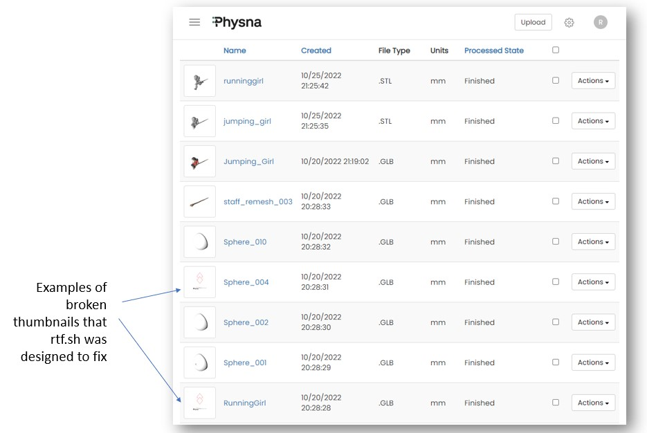

# rtf.sh
- `rtf.sh` is a [PCLI](https://github.com/jchultarsky101/pcli) based Physna reprocess script to be used when thumbnails are not being displayed on the Physna Enterprise GUI
- The `rtf.sh` command accepts three parameters so it can target the correct tenant, folder and decide whether to skip assemblies to focus just on parts.
- Reprocessing assemblies can lead to `missing-parts` issues hence the reason for the optional `<skip-assemblies>` parameter.
- RTF = Reprocess Thumbnails Fix

## Notes
- The path of the PCLI tool is hardcoded in the [script](https://github.com/rm511130/rtf/blob/main/rtf.sh) and needs to be edited to reflect the location of your [PCLI](https://github.com/jchultarsky101/pcli) executable.
- Once `rtf.sh` has been downloaded into a Linux Shell environment you will need to execute `$ chmod +x rtf.sh` to make `rtf.sh` an executable script.

## Syntax of the command

`$ ./rtf.sh <tenant-id> <folder-id> <skip-assemblies>`

- `<tenant-id>` and `<folder-id>` are mandatory. 
- `<skip-assemblies>` is an optinal parameter which, if used, needs to be `skip` (in lowercase)

## Examples:

`$ ./rtf.sh sandbox1 102 skip` 

The example above will execute the script on sandbox1.physna.com against folder ID 102 and it will skip assemblies
          
 `$ ./rtf.sh omicron 52` 
  
The example above will execute the script on omicron.physna.com against foder ID 52 and it will include parts and assemblies  
  
`$ ./rtf.sh` 
          
This third example returns a message with the expected syntax because the command is missing mandatory parameters


## Example of problems that `rtf.sh` can correct



## Logs from the execution of `rtf.sh`

The command `$ ./rtf.sh nut 12` produced the following log:

```
/mnt/c/Users/Ralph$ ./rtf.sh nu 12
Reprocess-Thumbnail-Fix on nu.physna.com  folderId = 12 and skip-assemblies = no
978ece7f-627a-40ca-9f5d-26596b4f6d30 "Cylinder_009" ".GLB" part Thumbnail is OK
978ece82-6945-4bb6-a0bd-f561f80f68f3 "Cylinder_011" ".GLB" part Thumbnail is OK
978ece79-6d20-4e90-92f3-dac4d9156886 "Body_contours_002" ".GLB" part Thumbnail is OK
978ece88-3743-4f7f-ae8c-51bb41c951af "Cylinder_016" ".GLB" part Thumbnail is OK
978ece7d-5f31-450c-9668-c42fa7c8020b "Cylinder_006" ".GLB" part Thumbnail is OK
978ece91-b1f6-4344-ac94-709215bde25e "Cylinder_023" ".GLB" part Thumbnail is OK
978ece8f-67bb-452b-989b-2ad40de24788 "Cylinder_022" ".GLB" part Thumbnail is OK
978ece85-7cf7-489a-b9f2-da5c80ba9158 "Cylinder_012" ".GLB" part Thumbnail is OK
978ece8b-e40f-4a0f-9c28-eac426375fc0 "Cylinder_020" ".GLB" part Thumbnail is OK
978ece95-7a28-4188-ba4f-d7c4ce054f62 "Plane_001" ".GLB" part Thumbnail is OK
978ececd-660e-4c5d-b330-82f79317d4fb "Plane_010" ".GLB" part Thumbnail is OK
978eced8-c487-44ad-826c-f5a3900aed2c "Plane_020" ".GLB" part Thumbnail is OK
978eced0-213c-458c-a675-d63fe361640c "Plane_015" ".GLB" part Thumbnail is OK
978eced2-5e4f-403c-8afb-635588924e7f "Plane_018" ".GLB" part Thumbnail is OK
978eced5-281c-4c26-b89c-a6a425f834fd "Plane_019" ".GLB" part Thumbnail is OK
978ecedc-2873-4398-865d-64689abaa49b "Plane_021" ".GLB" part Thumbnail is OK
978ecedf-a821-4c60-8ccd-f1022a190dee "Plane_022" ".GLB" part Thumbnail is OK
978ecee2-4c82-447e-be59-78fc0898ab67 "Plane_025" ".GLB" part Thumbnail is OK
978ecee4-5c56-4b57-8a1c-2f458afd95f5 "Plane_029" ".GLB" part
/mnt/c/Users/Ralph/pcli.exe -t nu reprocess --uuid 978ecee4-5c56-4b57-8a1c-2f458afd95f5
978eceed-8421-4ca3-8849-7d8464aaef7e "Plane_033" ".GLB" part Thumbnail is OK
978ecee7-d8ef-411a-b7eb-26884f0e86cd "Plane_031" ".GLB" part Thumbnail is OK
978ecee9-bacf-47f3-9d93-1423162834a5 "Plane_032" ".GLB" part
/mnt/c/Users/Ralph/pcli.exe -t nu reprocess --uuid 978ecee9-bacf-47f3-9d93-1423162834a5
978ecfb0-d457-46b6-8af5-55c6fe30e139 "Plane_035_019" ".GLB" part
/mnt/c/Users/Ralph/pcli.exe -t nu reprocess --uuid 978ecfb0-d457-46b6-8af5-55c6fe30e139
978ecfc9-6652-4146-ad7a-dc79f3184085 "Plane_039" ".GLB" part Thumbnail is OK
978ecfc3-26db-49e7-970a-c83b74b8d1b6 "Plane_036" ".GLB" part
/mnt/c/Users/Ralph/pcli.exe -t nu reprocess --uuid 978ecfc3-26db-49e7-970a-c83b74b8d1b6
978ecfce-de61-4ac6-82bc-90a1ad0814c2 "Plane_041" ".GLB" part
/mnt/c/Users/Ralph/pcli.exe -t nu reprocess --uuid 978ecfce-de61-4ac6-82bc-90a1ad0814c2
978ecfdd-1680-4dea-9415-77a255c28f88 "Sphere_001" ".GLB" part Thumbnail is OK
978ecfe0-962b-4ca0-87cc-51e2e385884c "Sphere_002" ".GLB" part Thumbnail is OK
978ecfe2-9c97-4f0b-bf13-3e09e305983f "Sphere_004" ".GLB" part
/mnt/c/Users/Ralph/pcli.exe -t nu reprocess --uuid 978ecfe2-9c97-4f0b-bf13-3e09e305983f
978ecfda-cdee-4fca-bd80-e988b9f0fe45 "RunningGirl" ".GLB" part
/mnt/c/Users/Ralph/pcli.exe -t nu reprocess --uuid 978ecfda-cdee-4fca-bd80-e988b9f0fe45
978ecfe6-1b80-4dc8-9f9b-6d395d2d5cd0 "Sphere_010" ".GLB" part Thumbnail is OK
978ecfe9-7709-4152-995c-d79d43b230a0 "staff_remesh_003" ".GLB" part Thumbnail is OK
978ef3fd-345a-4746-83c1-907648bbc4cd "Jumping_Girl" ".GLB" part Thumbnail is OK
97a31691-98b3-4a30-813b-5fe49727cdf3 "runninggirl" ".STL" part Thumbnail is OK
97a315d7-6e2f-4ec8-97e7-c067fae8ce25 "jumping_girl" ".STL" part Thumbnail is OK
 END
```


